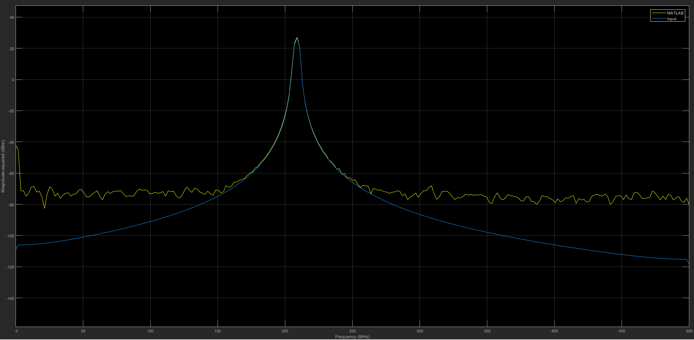

 In this project, I have used AMD/Xilinx library in MATLAB/SIMULINK to make an LPFIR filter. Also, I have used the FDA tool to calculate the filter coefficients. It is assumed that the input is a signal that is sampled at a rate of 1 GSample/s. To do the filtering process in the FPGA, the input should be parallelized by a proper factor to be compatible with the FPGA operational frequency. As a result, it will be parallelized by a factor of 4, each with a sample rate of 250 MSample/s. Input is considered as fixed-point data with the "1.14.12" configuration. 
It should be noted that, in this project, the AMD/Xilinx tool (Viado) version 2021.2 and MATLAB R2020a have been used. You should pay attention to the compatibility between different versions of AMD/Xilinx tool (Vivado/Vitis) and MATLAB. This project is mainly for understanding the input/output data rates, FPGA operational clock, parallelizing, and filtering concepts. 

**
Fig1. Block Diagram of the 1GHz FIR filter 
**
 

Here are the outputs while the input is a chirp signal:

**
Fig2. Input and Output in pass-band 
**
 

**
Fig3. Input and Output in stop-band 
**
 
