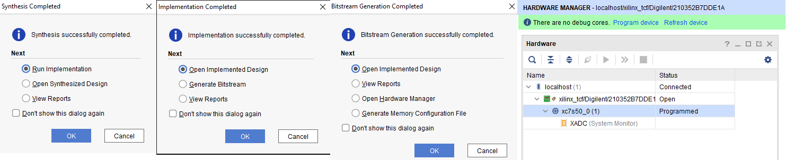
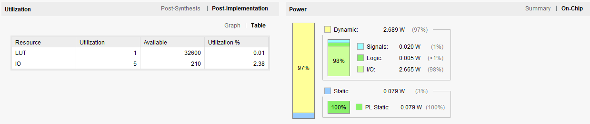
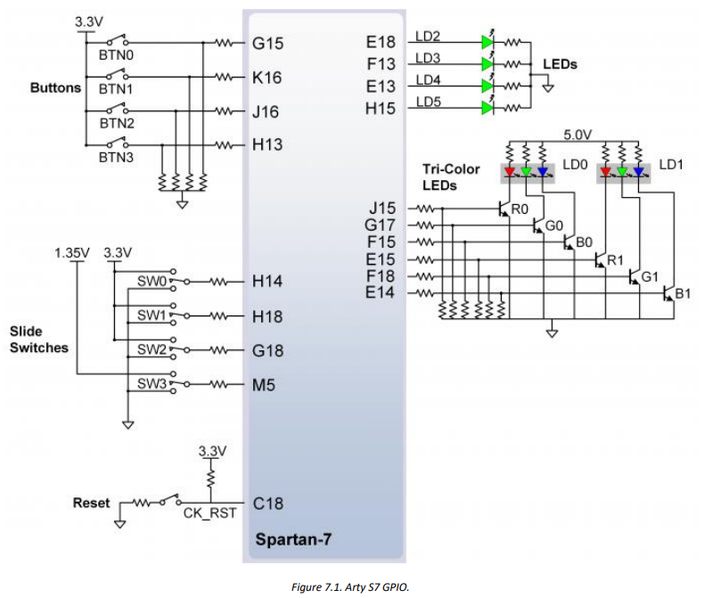
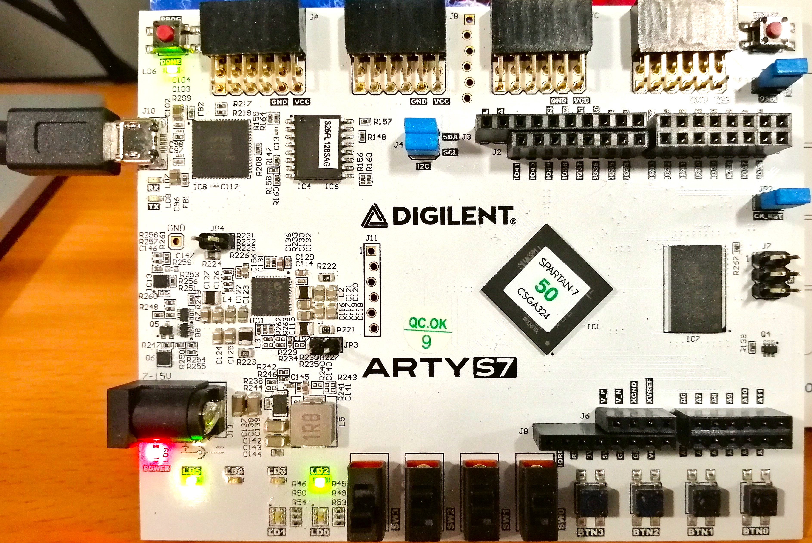
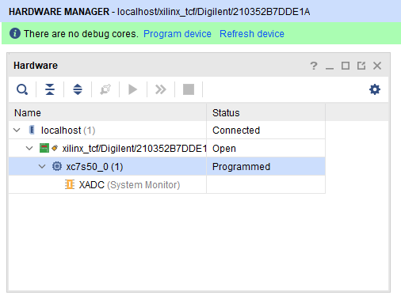

 This project describes the design of a 1-bit full adder in VHDL and is implemented in Xilinx Vivado 2021.2. This design is tested on the "Digilent Arty S7-50" evaluation board which uses an "XC7S50-1CSGA324C" Spartan7 FPGA. In Fig. 1, the simulation result is demonstrated corresponding to the input signals given in the test bench. 

**
Fig1. Simulation Result
**
 

Fig.2 shows the successful completion of the Synthesis, Implementation, and Bitstream generation steps and the target hardware used in this design.

**
Fig2. Design Reports
**
 

In Fig.3, the FPGA's resource utilization and power consumption are shown.

**
Fig3. Resource utilization and power consumption
**
 

In Fig.4, we can see the schematic of the Arty S7 board, focusing on the slide switches and LEDs. Three slide switches corresponding to the three inputs, and also two LEDs corresponding to the two outputs are used in this design. 

**
Fig4. FPGA Pinouts for slide switches and LEDs in Arty S7 FPGA board
**
 

In the end, and in Fig.5, the real FPGA board demonstrating the result of the design is demonstrated. As all the input values are high (value 1), both the LEDs have become on.

**
Fig5. Arty S7 board showing the result of the design
**
 

 
