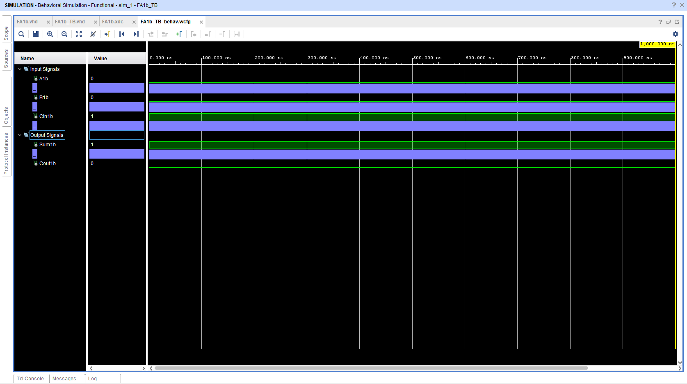

This project describes the design of a 1-bit full adder in VHDL. It is implemented in Xilinx Vivado 2021.2. This design is tested on the "Digilent Arty S7-50" evaluation board which uses an "XC7S50-1CSGA324C" Spartan7 FPGA. In Fig. 1, the simulation result is demonstrated corresponding to the input signals given in the test bench.

