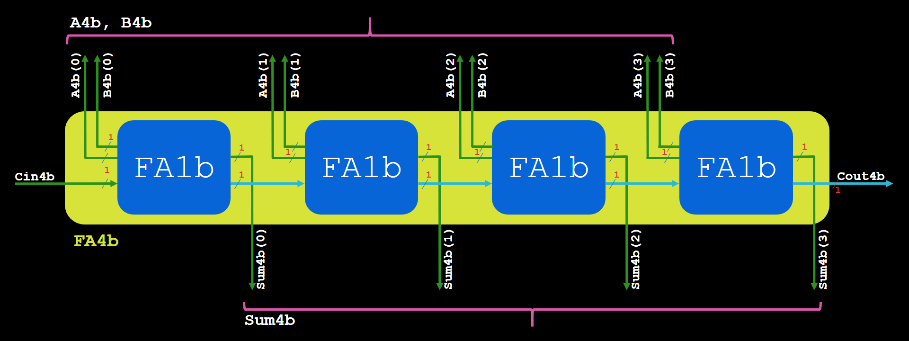
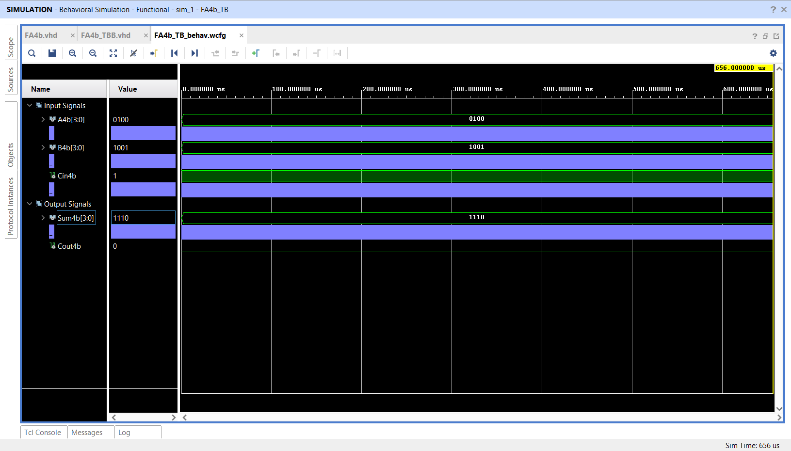
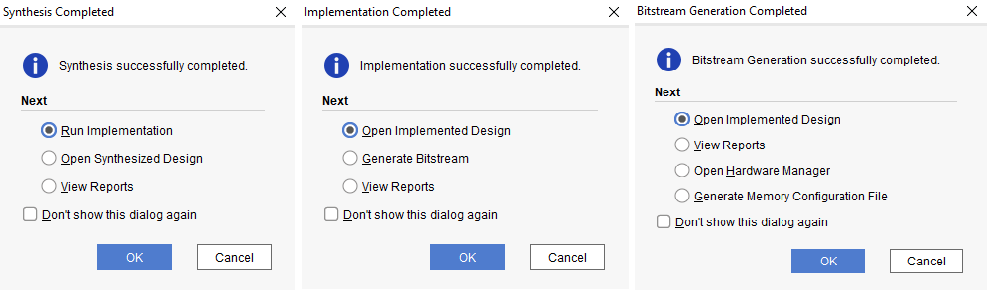
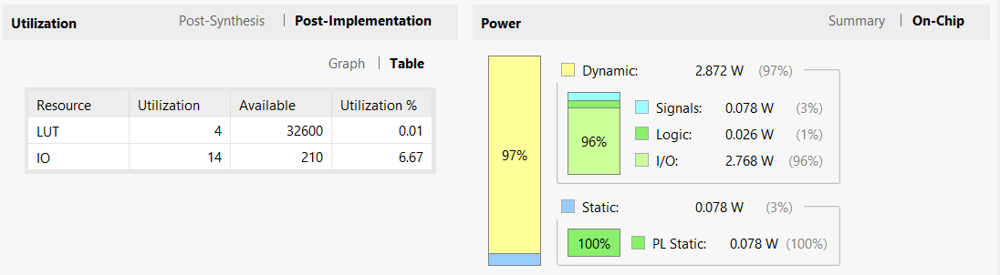

 This project describes the design of a 4-bit full adder using 4 "1-bit full adder" sub-modules in VHDL. In this project, we will learn how to use modular structure in a project in Vivado and VHDL. Using the Xilinx-AMD Vivado 2021.2 tool, the target evaluation board in this project is the "Digilent Arty S7-50" which uses an "XC7S50-1CSGA324C" Spartan7 FPGA. You can see the block diagram of the design in Fig.1. 

**
Fig1. Block Diagram of the 4-bit Full Adder
**
 

 In Fig. 2, the simulation result is demonstrated corresponding to the input signals given in the test bench. 

**
Fig2. Simulation Result
**
 

Fig.3 shows the successful completion of the Synthesis, Implementation, and Bitstream generation steps.

**
Fig3. Design Reports
**
 

In Fig.4, the FPGA resource utilization and power consumption are shown.

**
Fig4. Resource utilization and power consumption
**
 

**
Fig5. Arty S7 board showing the result of the design
**
 

